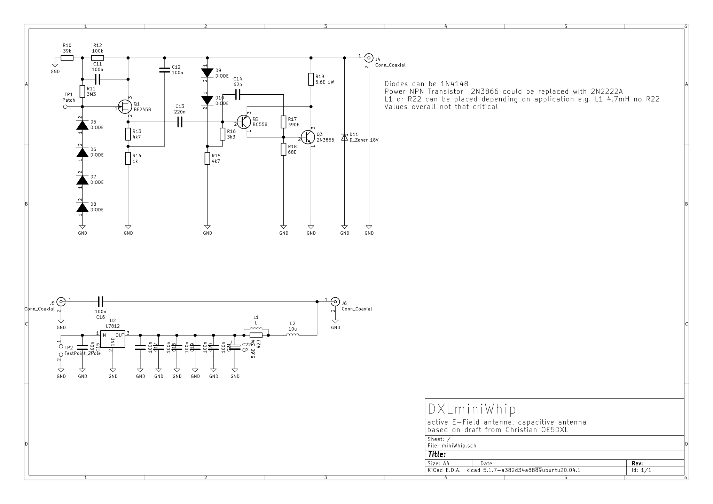
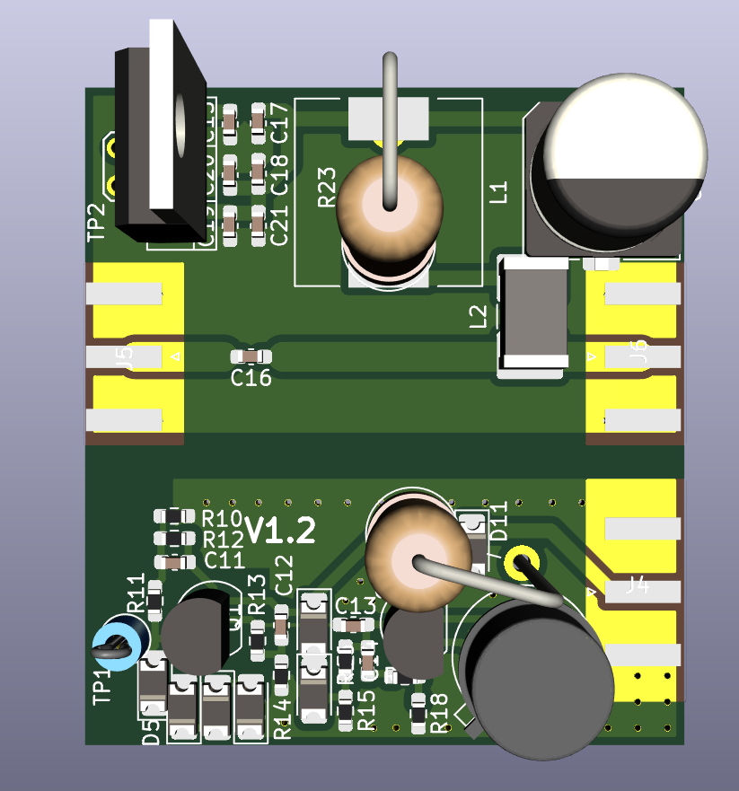
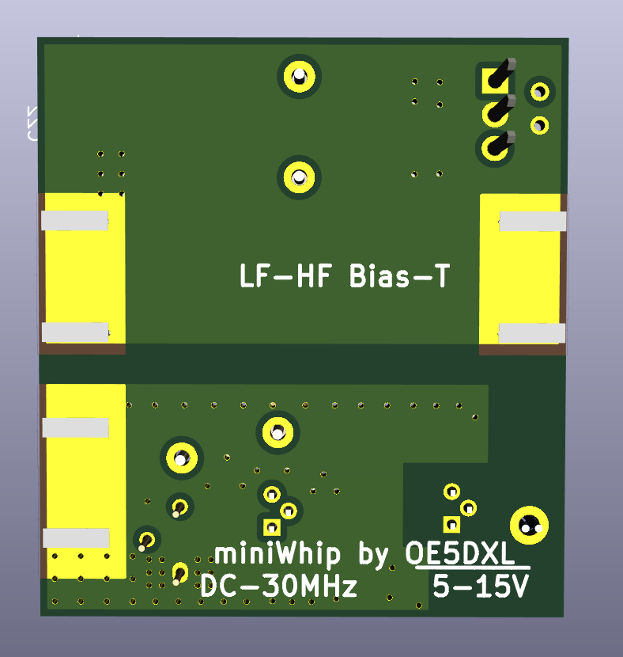

# miniWhip
e-field antenna optimized for low frequencies  
lower corner frequency limited by bias-T, with 470mH below 10kHz  
upper corner frequency arround 70MHz  
supply Voltage 5-15Vs

## Schematic

## Pictures

## License
project is published unter GPLv2 license
